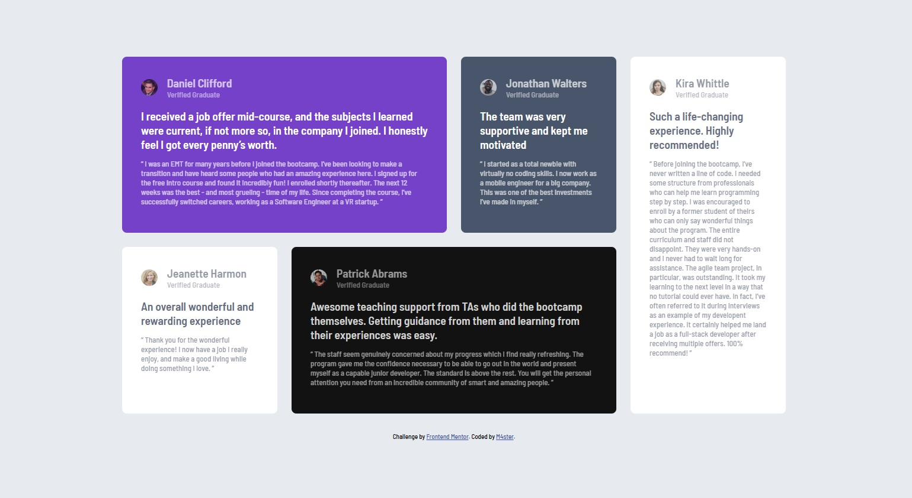

# Frontend Mentor - Testimonials grid section

## Table of contents

- [Overview](#overview)
  - [Screenshot](#screenshot)
  - [Links](#links)
- [My process](#my-process)
  - [Built with](#built-with)
  - [What I learned](#what-i-learned)
  - [Continued development](#continued-development)
  - [Useful resources](#useful-resources)
- [Author](#author)
- [Acknowledgments](#acknowledgments)

## Overview

### Screenshot

### Links

- Solution URL: https://github.com/Master-Chowan/Testimonials-grid-section

- Live Site URL:https://master-chowan.github.io/Testimonials-grid-section/

## My process

### Built with

- Semantic HTML5 markup
- CSS custom properties
- CSS Grid

### What I learned 

Learned about grid-area and how to apply for better organization of the components

### Continued development

Keep learning new features and tricks

### Useful resources

- [resource 1](https://www.youtube.com) - This page helps me with tutorials from different authors.

## Author

- Frontend Mentor - [@Master-Chowan](https://www.https://www.frontendmentor.io/profile/Master-Chowan)